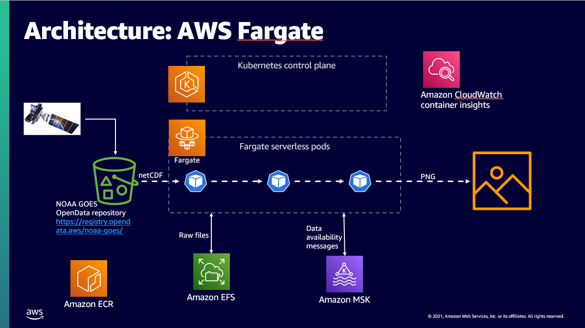

# ETL on EKS and Fargate

This project is a sample of how to use EKS and Fargate. This example deploys a simple ETL (extract, transform, load) that takes GOES-16 NetCDF files and converts them into PNG files and loaded into S3. 

This sample is designed to be used in an AWS workshop. 

This example uses the following AWS Services:
[IAM](https://aws.amazon.com/iam/)
[EKS](https://aws.amazon.com/eks)
    [eksctl]()
[Fargate](https://eksctl.io/)
[CloudWatch](https://aws.amazon.com/cloudwatch/)
[Container Insights](https://docs.aws.amazon.com/AmazonCloudWatch/latest/monitoring/ContainerInsights.html)
[EFS](https://aws.amazon.com/efs/)
[S3](https://aws.amazon.com/pm/serv-s3)

The data are from NOAA Geostationary Operational Environmental Satellites (GOES) 16 & 17 hosted on the [Registry of Open Data on AWS](https://registry.opendata.aws/noaa-goes/)

## Structure
* etl-efs - Containers the code for the ETL pipeline, build scripts and Dockerfiles for each image
* infs - Starts up the EKS and Fargate clusters, configures EFS, S3, IAM, MKS
* testharness - pulls the raw files from the Open data Registry and pushes it to the ingest services of HTTPS

## License

Copyright Amazon.com, Inc. or its affiliates. All Rights Reserved.

Permission is hereby granted, free of charge, to any person obtaining a copy of this
software and associated documentation files (the "Software"), to deal in the Software
without restriction, including without limitation the rights to use, copy, modify,
merge, publish, distribute, sublicense, and/or sell copies of the Software, and to
permit persons to whom the Software is furnished to do so.

THE SOFTWARE IS PROVIDED "AS IS", WITHOUT WARRANTY OF ANY KIND, EXPRESS OR IMPLIED,
INCLUDING BUT NOT LIMITED TO THE WARRANTIES OF MERCHANTABILITY, FITNESS FOR A
PARTICULAR PURPOSE AND NONINFRINGEMENT. IN NO EVENT SHALL THE AUTHORS OR COPYRIGHT
HOLDERS BE LIABLE FOR ANY CLAIM, DAMAGES OR OTHER LIABILITY, WHETHER IN AN ACTION
OF CONTRACT, TORT OR OTHERWISE, ARISING FROM, OUT OF OR IN CONNECTION WITH THE
SOFTWARE OR THE USE OR OTHER DEALINGS IN THE SOFTWARE.